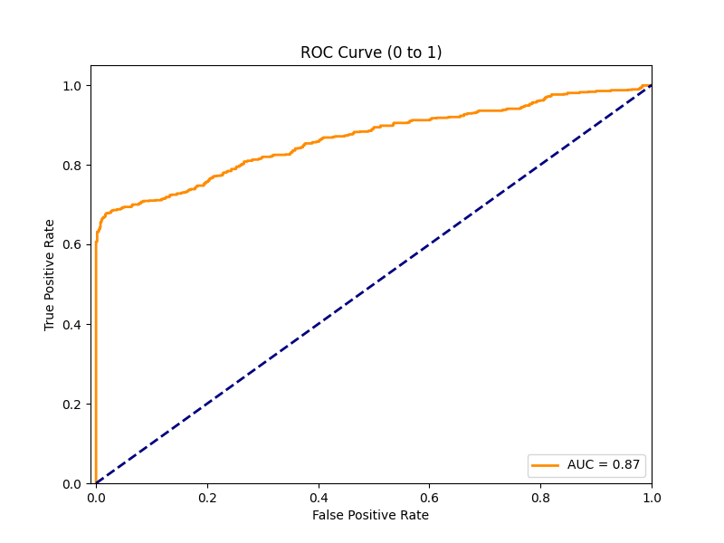

# Digital Image Watermarking Using Fibonacci Spiral and DWT-SVD

## Contributors

- Collizzolli Leonardo
- Graziadei Ylenia
- Lechthaler Pietro

## Abstract
Digital image watermarking is a technique used to embed hidden information, or "watermarks," within an image to protect copyright, verify authenticity, and ensure content integrity. This project explores a robust watermarking approach that combines Fibonacci spiral positioning with the Discrete Wavelet Transform (DWT) and Singular Value Decomposition (SVD) for embedding. The Fibonacci spiral, a unique geometric structure, is used to determine key embedding locations within the image, ensuring spatial robustness and reducing visibility of the watermark. DWT-SVD is then applied to these selected regions, leveraging the transform's ability to localize frequency and spatial information, thus enhancing resistance against image processing attacks such as compression, blurring, noise, and resizing. Evaluation of the watermarked images is performed using Weighted Peak Signal-to-Noise Ratio (wPSNR), assessing watermark resilience and perceptual quality across multiple attack scenarios. This approach aims to provide an effective balance between robustness and image fidelity.

## Description
This watermarking algorithm tries to be an innovative embedding strategy that combines a Fibonacci spiral for selecting key positions within the image with a combined approach of Discrete Wavelet Transform (DWT) and Singular Value Decomposition (SVD) for embedding the watermark. The primary goal is to ensure that the watermark is both resistant to attacks and visually imperceptible.


The watermarking process starts by selecting embedding points using five predefined Fibonacci spirals. Two central points are considered for optimal watermark placement: the first is the image’s actual center, while the second is determined by variance analysis of four corner quadrants. Specifically, the quadrant with the lowest variance is identified, and its opposite quadrant becomes the second candidate center, maximizing both robustness and visual quality. Thus, the process begins with two potential centers for embedding.

Once the embedding points are arranged along Fibonacci spirals centered on each of these candidate points, the image undergoes a Discrete Wavelet Transform (DWT), which decomposes it into distinct frequency bands. The watermark is embedded in the low-frequency (LL) band, known for its resilience to common attacks like compression and resizing. Within this band, Singular Value Decomposition (SVD) is used to break down the content further into singular component matrices (U, S, V). The watermark embedding is achieved by subtly modifying the singular values (S) based on a scaling factor (`ALPHA`), which controls watermark intensity, balancing robustness against attacks with visual transparency.

Finally, the configuration yielding the highest average Weighted Peak Signal-to-Noise Ratio (wPSNR) across all attacks is chosen, indicating the optimal trade-off between robustness and minimal visual impact. Once the optimal spiral configuration is chosen, the inverse transformations are applied to reconstruct the final watermarked image. The modified singular values (S) in the LL band are restored by applying the Inverse Singular Value Decomposition (SVD) on each block, followed by the Inverse Discrete Wavelet Transform (IDWT) to recompose the frequency bands into a single, unified image. This final step ensures the watermark is securely embedded while preserving the visual integrity of the original image, completing the watermark embedding process.


## Repository Structure

```python
📦 polymer/
├── 📁 src/
│   ├── 📄 launcher.py #script for testing
│   ├── 📄 embedding_polymer.py #watermark embedding script
│   ├── 📄 detection_polymer.py #watermark detection script
│   ├── 📄 attacks.py #attack watermark images script
│   ├── 📄 roc_polymer.py #roc generation script
│   ├── 📄 generation_watermark.py #script to generate random watermark
│   └── 📁 utilities/
│       ├── 📄 csf.csv
│       └── 📄 watermark.npy #generated watermark file
├── 📁 sample_images/ 
│   ├── 📄 0001.bmp #sample grayscale images
│   ├── 📄 0002.bmp
│   ├── 📄 ...
│   └── 📄 000N.bmp
├── 📄 README.md
├── 📄 requirements.txt
└── 📄 LICENSE
```


## Environment Setup
To ensure compatibility and reproducibility, this project requires Python 3.8.10.

1. Install Python 3.8.10
Ensure you have Python 3.8.10 installed. You can download it from python.org if it’s not already installed.

2. Create a virtual environment using Python 3.8.10
`python3.8 -m venv .env`

3. Activate the virtual environment
`source .env/bin/activate`

4. Install Dependencies
With the virtual environment activated, install the required packages from requirements.txt
`pip install -r requirements.txt`

## Usage

### Generate Watermark
To create a binary watermark for embedding, you can use `generation_watermark.py` script to generate a random watermark and save it as a .npy file in `src/utilities` folder.
```bash
python generation_watermark.py
```

### Embedding 
To embed a watermark in an image, use the `embedding()` function, which integrates a watermark into the specified image using the Fibonacci spiral and DWT-SVD method. The function accepts the paths to both the original image and the watermark file (saved in .npy format) and returns the best watermarked image after evaluating its robustness under different attack scenarios.

```python
import embedding_polymer

original_image_path = 'path/to/original_image'
watermark_path = 'path/to/watermark'
watermarked = embedding_polymer.embedding(original_image_path, watermark_path)
```

### Detection
The `detection()` function evaluates the integrity of a watermarked image after an attack by comparing the watermarks extracted from both the original watermarked image and the attacked image. 
The function uses similarity and wPSNR values to determine whether the watermark has been significantly degraded, indicating a successful attack.

```python
import detection_polymer
import cv2

original_image_path = 'path/to/original_image'
watermarked_image_path = 'path/to/watermarked_image'

original_image = cv2.imread(original_image_path)
watermarked_image = cv2.imread(watermarked_image_path)

watermarked_image_path = 'path/to/watermarked/image'
watermark_extracted = detection_polymer.detection(original_image, watermarked_image, watermarked_image)
```

Detection function outputs:
1. `attack success status`:
- 1 if the attack was successful, meaning the watermark has been significantly compromised.
- 0 if the attack was unsuccessful, meaning the watermark is still detectable.
2. `wPSNR value` between the watermarked and attacked images.

### Testing
The `launcher.py` script can be used to test the embedding and detection functions. 
```bash
python launcher.py
```
### ROC curves
To evaluate the watermarking algorithm's effectiveness, a **Receiver Operating Characteristic (ROC) Curve** is generated, which illustrates the trade-off between the True Positive Rate (TPR) and False Positive Rate (FPR) at varying threshold levels. This helps assess the algorithm’s ability to differentiate between images with and without the watermark under various attack conditions.



The `compute_roc()` function applies random attacks to watermarked images and compares the extracted watermark against both the original and a random generated watermark. Similarity scores between the original watermark and the extracted watermark are calculated to assess whether an attack has significantly degraded the watermark. Using these similarity scores, the function computes the **True Positive Rate (TPR)** and **False Positive Rate (FPR)** across thresholds, producing two ROC curves:

- **Full ROC** – provides an overview of the algorithm’s overall detection performance.
- **Zoomed ROC** (restricted to an FPR of 0.1) – offers a closer look at lower false positive regions.

Both ROC curves are saved as images (`roc_full_polymer.png` and `roc_zoomed_polymer.png`). The **AUC (Area Under Curve)** metric is also computed as a summary of overall detection performance, where higher values indicate better detection accuracy.


### Attacks
Six attack types are defined, each with its own set of parameters to vary the intensity of the attack:

1. `JPEG Compression`: Specifies quality factors (QF) from very low (1) to relatively high (70).
2. `AWGN (Additive White Gaussian Noise)`: Specifies standard deviations (from 2.0 to 50.0) and mean values (0.0 to 5.0) to add Gaussian noise.
3. `Blur`: Applieas a Gaussian filter with with a specified standard deviation.
4. `Sharpening`: Specifies sigma values and alpha values, where `sigma` controls the Gaussian filter and `alpha` controls sharpening intensity.
5. `Median Filtering`: Specifies kernel sizes to adjust the level of median filtering.
6. `Resizing`: Resizes the image based on the specified scaling factor with values from 0.01 to 10, then resizes it back to the original dimensions to simulate resizing artifacts.
 
Additionally, a CSV file is automatically to store all characteristics of successful attacks. This file includes valuable metrics and parameters that detail the effectiveness and outcomes of each attack, making it easier to analyze the results systematically.


